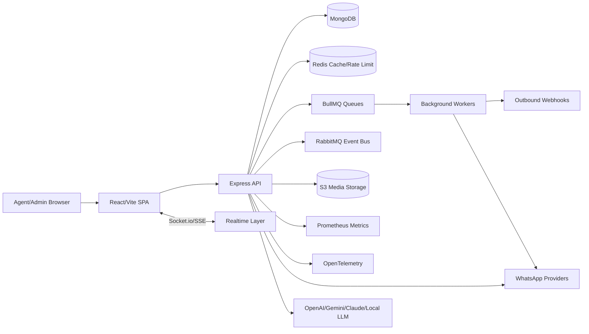
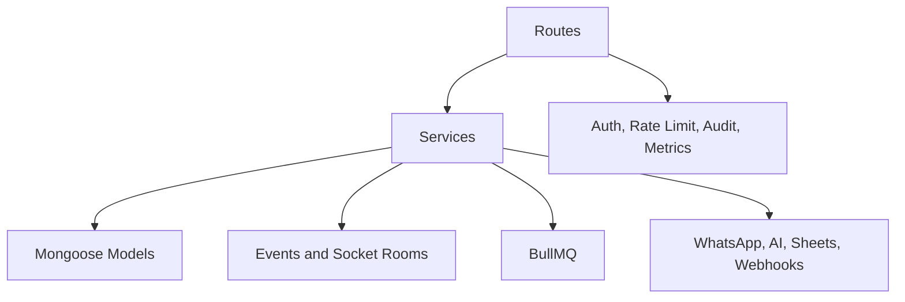

# Architecture

## System Diagram

## Backend Layers

## Domain Modules

- Inbox: conversations, messages, contacts, assignments, receipts.
- CRM: contacts, leads, notes, timeline, tags, custom fields.
- Campaigns: templates, campaigns, imports, approvals, queues, metrics.
- Automation: flows, nodes, triggers, tests, runtime actions.
- AI: summaries, drafts, RAG documents, memory, tool calls.
- Admin: companies, tenants, users, roles, permissions, billing, audit.
- Analytics: messages, agents, leads, revenue, templates, automation.
- Infrastructure: health, metrics, queues, cache, flags, deployment.

## Scaling Model

- Stateless API pods behind load balancer.
- Sticky or shared Socket.io adapter should be added when scaling realtime beyond one pod.
- MongoDB replica set with backups.
- Redis for shared rate limits, BullMQ, and cache.
- RabbitMQ for durable cross-service events.
- S3/CDN for media delivery.
