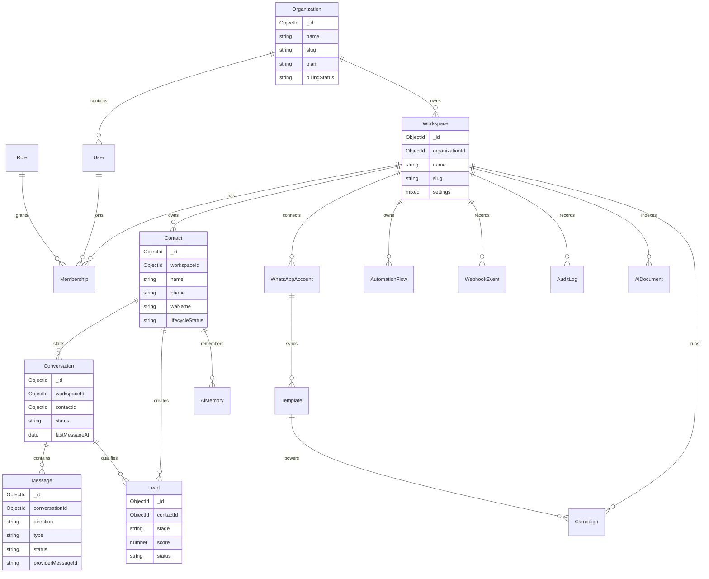

# Database ERD

## Indexing Notes

- `Message`: `{ conversationId, createdAt }`, `{ workspaceId, providerMessageId }`, `{ workspaceId, clientMessageId }`.
- `Conversation`: `{ workspaceId, status, lastMessageAt }`, `{ workspaceId, assignedToUserId, status }`.
- `Contact`: `{ workspaceId, phone }` unique.
- `Lead`: `{ workspaceId, contactId, status }`, `{ workspaceId, stage, lastActivityAt }`.
- `WebhookEvent` and `AuditLog`: `{ workspaceId, createdAt }`.
